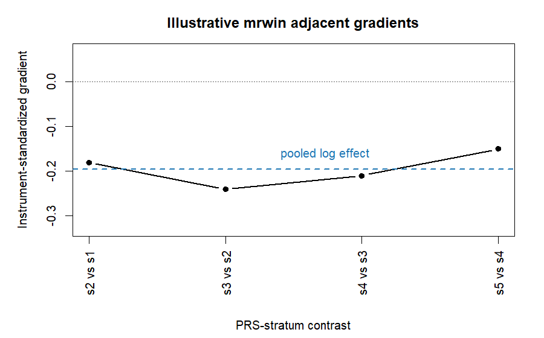

# mrwin

`mrwin` is a work-in-progress R package for causal win-statistic analyses with
hierarchical composite endpoints.

The package is designed for epidemiology and clinical-outcome studies where one
outcome is not enough. A typical endpoint may prioritize death first, then a
major hospitalization, then a lower-priority disease event. `mrwin` estimates
whether a genetically predicted exposure shifts people toward better or worse
overall outcome profiles while respecting that clinical hierarchy.

The primary user interface is R. The Python implementation is retained under
`python/` only as a prototype and validation harness while the R package
matures.

## Project status

Current checkpoint: 2026-05-10.

- Completed: WP0 through WP8.
- Current work package: WP9, performance backend and benchmark validation.
- Main implemented path: dense R workflow with validation, DS-CWR estimator, multiplier-bootstrap inference, ordinal-IPTW adjustment, SDPD diagnostics, small scenario-grid simulation, and structured warning outputs.
- Not release-ready yet: performance backend, user reporting/vignettes, CI/release gates, GPS adjustment, full-covariance GWAS bootstrap, full-size Monte Carlo validation, and biobank-scale sparse/Rcpp backend.

Progress details are tracked in [inst/spec/project-checkpoint.md](inst/spec/project-checkpoint.md). The strategic roadmap remains [inst/spec/work-package-roadmap.md](inst/spec/work-package-roadmap.md).

## When to use it

Use `mrwin` when your study has these ingredients:

- individual-level cohort data;
- ordered endpoint priorities, for example death before hospitalization before biomarker decline;
- genotype or PRS data;
- external GWAS SNP-exposure effects;
- an exposure that may affect several outcome components in different ways.

The main result, `DS-CWR`, is a dose-standardized causal win ratio. On the
default endpoint coding, values above 1 suggest a more favorable prioritized
win profile as the exposure increases; values below 1 suggest a less favorable
profile. Always check the exposure direction, endpoint priority order, and
warnings before making a causal interpretation.

## Example research questions

| Area | Exposure example | Endpoint hierarchy | Plain-language question |
|---|---|---|---|
| Cardiovascular disease | LDL cholesterol, systolic blood pressure, smoking liability | death, heart failure hospitalization, renal decline | Does the exposure worsen the overall cardiorenal trajectory, giving death highest priority? |
| Smoking epidemiology | genetic liability to smoking initiation or cigarettes/day | death, lung cancer, COPD hospitalization | Does smoking liability reduce the chance of a favorable prioritized respiratory/cancer outcome profile? |
| Dementia | genetically predicted LDL, education, sleep trait, APOE/PRS exposure proxy | death, dementia diagnosis, nursing-home admission | Does the exposure shift people toward earlier severe neurocognitive outcomes after accounting for death as a competing high-priority event? |
| Cancer epidemiology | BMI, smoking, alcohol, inflammatory biomarker | cancer death, progression/metastasis, recurrence | Does the exposure worsen clinically prioritized cancer outcomes rather than only one component? |

These examples are templates. The package does not choose the clinical priority
order for you; that decision must be made before running the analysis.

## Data You Need

For a real cohort, prepare one analysis row per participant:

| Data block | Example columns | Notes |
|---|---|---|
| Endpoint times | `t_death`, `t_hf`, `t_renal` | one time column per priority |
| Endpoint statuses | `d_death`, `d_hf`, `d_renal` | binary event indicators, 0/1 |
| Exposure | `ldl`, `sbp`, `smoking_index` | individual-level exposure |
| Genotype/PRS SNPs | `rs1`, `rs2`, ... | numeric genotype dosage columns |
| GWAS summary | `beta`, `se`, `snp` | external SNP-exposure effects |
| Covariates | `age`, `sex`, `PC1`, `PC2` | optional, used for ordinal IPTW adjustment |

Endpoint order matters. In a cardiorenal example, `death` should come before
heart failure and renal decline if death is the highest-priority clinical event.

## Quick Start

This simulated cardiorenal example can be run without reading the manuscript:

```r
cfg <- mrwin_config(n_outcome = 500, m_snps = 20, seed = 1)
dat <- mrwin_simulate(cfg)

fit <- mrwin(
  endpoint = mrwin_endpoint(dat$time, dat$status, c("death", "hf", "renal")),
  genotype = dat$G,
  exposure = dat$X,
  gwas = mrwin_gwas(dat$true_betas, rep(0.01, length(dat$true_betas))),
  controls = mrwin_controls(n_strata = 5, bootstrap = 100, seed = 2)
)

summary(fit)
plot(fit)
```

With covariate adjustment and SDPD diagnostics:

```r
fit_adj <- mrwin(
  endpoint = mrwin_endpoint(dat$time, dat$status, c("death", "hf", "renal")),
  genotype = dat$G,
  exposure = dat$X,
  gwas = mrwin_gwas(dat$true_betas, rep(0.01, length(dat$true_betas))),
  covariates = cbind(u_proxy = scale(dat$U)),
  controls = mrwin_controls(
    n_strata = 5,
    bootstrap = 100,
    seed = 2,
    adjustment = "ordinal_iptw",
    sdpd_scale = "both",
    pleiotropy_bias_radius = 0.05
  )
)
```

## How to Read the Output

`print(fit)` gives the main result:

```text
mrwin fit
  N: 500
  SNPs: 20
  Priorities: 3
  Strata: 5
  Bootstrap: 100(100 valid)
  delta_GLS: -0.2000
  DS-CWR: 0.8187
  95% CI: 0.7000 to 0.9600
  Warnings: 1
```

How to interpret the main fields:

| Field | Meaning | Epidemiologic reading |
|---|---|---|
| `delta_GLS` | pooled log-scale effect | negative means the exposure direction is associated with a worse prioritized win profile |
| `DS-CWR` | exponentiated main effect | below 1 suggests harm; above 1 suggests benefit, given endpoint coding |
| `95% CI` | bootstrap uncertainty interval | check whether it crosses 1 on the DS-CWR scale |
| `Warnings` | structured caveats | inspect before reporting the result |

`summary(fit)` gives more detail:

- `estimate`: main DS-CWR, CI, and optional pleiotropy-bounded CI.
- `adjacent`: local gradients across PRS strata. These show whether the effect is stable across the exposure score range.
- `heterogeneity`: Q statistic. A small p-value suggests the local gradients differ across strata.
- `sdpd`: pleiotropy diagnostic for the highest-priority endpoint.
- `warnings`: machine-readable warnings such as weak instrument, SDPD rejection, positivity failure, or bridged strata.

## Plotting

`plot(fit)` displays adjacent instrument-standardized gradients. The dashed
horizontal line is the pooled estimate. A stable pattern supports a clearer
summary; strong swings across strata suggest heterogeneity that needs
interpretation.



In the plot above, all adjacent gradients are below 0. For the default endpoint
coding, that points toward a worse prioritized outcome profile as the exposure
increases. If one stratum contrast moves in the opposite direction, inspect
`summary(fit)$adjacent` and the Q statistic before writing a conclusion.

## Warning Codes

| Code | What it means | What to do |
|---|---|---|
| `weak_instrument` | phenotypic shift is near zero or Fieller CI is unbounded | treat the estimate as unstable |
| `sdpd_rejected` | MR-Egger intercept suggests priority-1 direct pleiotropy | do not treat the cCWR estimate as cleanly valid without sensitivity discussion |
| `sdpd_underpowered` | too few valid SNPs for a reassuring SDPD non-rejection | report that pleiotropy may be missed |
| `positivity_failure` | IPTW effective sample size is too small in at least one stratum | inspect covariate overlap and dropped strata |
| `bridged_strata` | one or more strata were skipped and neighboring strata bridged | report the bridged contrast schema |
| `discordant_components` | component-level directions conflict | avoid summarizing as a simple global benefit/harm |

## Real Cohort Template

For a cardiovascular cohort stored in a data frame `dat`:

```r
snp_cols <- paste0("rs", 1:20)

fit <- mrwin(
  data = dat,
  endpoint = mrwin_endpoint(
    time = c("t_death", "t_hf", "t_renal"),
    status = c("d_death", "d_hf", "d_renal"),
    priority = c("death", "heart_failure", "renal_decline")
  ),
  genotype = snp_cols,
  exposure = "ldl_cholesterol",
  gwas = mrwin_gwas(beta = beta_hat, se = se_beta, snp = snp_cols),
  covariates = c("age", "sex", "PC1", "PC2"),
  controls = mrwin_controls(
    n_strata = 10,
    bootstrap = 500,
    seed = 20260510,
    adjustment = "ordinal_iptw",
    sdpd_scale = "both"
  )
)

summary(fit)
plot(fit)
```

The same structure can be adapted for smoking, dementia, or cancer studies by
changing the exposure, endpoint priority order, SNP set, and covariates.

## Simulation Grids

Small simulation grids use the WP8 scenario engine:

```r
scenarios <- mrwin_scenarios(
  mrwin_config(n_outcome = 200, m_snps = 10, seed = 10),
  scenarios = c("A_null", "B_valid_IV", "C_pleiotropy", "D_hierarchy_discordant")
)

grid <- mrwin_run_simulation_grid(
  scenarios = scenarios,
  n_iter = 2,
  controls = mrwin_controls(n_strata = 4, bootstrap = 20, seed = 11, run_sdpd = FALSE),
  run_sdpd = TRUE,
  run_benchmark = TRUE
)

mrwin_simulation_summary(grid)
```

Use this engine for method checks and teaching examples. Full-size Monte Carlo
validation should be run separately from ordinary unit tests.

## Core R API

Main exported functions:

- `mrwin()` runs the high-level individual-level workflow.
- `mrwin_endpoint()`, `mrwin_gwas()`, and `mrwin_controls()` define analysis inputs explicitly.
- `mrwin_validate_data()` checks endpoint, genotype, exposure, GWAS, covariates, strata, and terminal-event consistency before estimation.
- `mrwin_config()` and `mrwin_simulate()` create v5-style simulation inputs.
- `mrwin_scenarios()`, `mrwin_run_simulation_grid()`, and `mrwin_simulation_summary()` run small Package A-D scenario grids.
- `mrwin_per_component_benchmark()` compares cCWR context against per-component MR baselines.
- `mrwin_kernel()` computes the hierarchical pairwise win/loss/tie kernel.
- `mrwin_estimate()`, `mrwin_gls_pool()`, and `mrwin_multiplier_bootstrap()` implement estimation and inference.
- `mrwin_propensity_weights()` computes ordinal-IPTW stabilized weights, ESS diagnostics, and positivity-filtered active strata.
- `mrwin_sdpd()` runs the Step-Down Pleiotropy Diagnostic.
- `mrwin_pleiotropy_bounded_ci()` widens the DS-CWR CI by an SDPD-implied bias band.

## Python Prototype

The Python code is not the intended long-term package interface. It is kept to preserve the current computational checks while the R implementation is written.

```bash
python -m pip install -r requirements.txt
python -m pytest
```

## Scope

The repository intentionally excludes manuscript drafts, replication outputs, and generated report files. Code and package tests belong here; paper text and publication artifacts should stay outside the repository or in a separate manuscript repository.

## Implementation Spec

The package implementation plan is frozen in [inst/spec/algorithm-spec.md](inst/spec/algorithm-spec.md). This document maps the paper v5.1/v5.2 methods to R package functions, test oracles, edge cases, and remaining implementation gaps.

The canonical work-package sequence is tracked in [inst/spec/work-package-roadmap.md](inst/spec/work-package-roadmap.md). It records WP0 plus the 12 main work packages WP1-WP12, with progress complete through WP8 and WP9 next.
